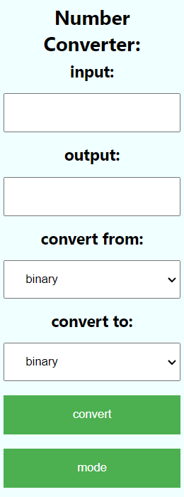
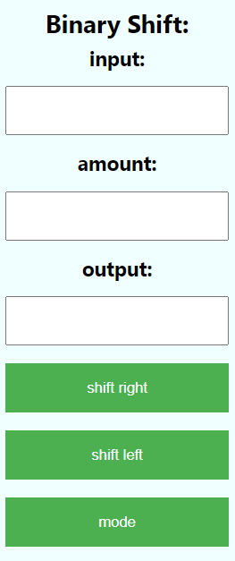

# About:

this a chrome extention designed to help converting binary and hex. It also has a binary shifter built in.

# How to install:

1. download the zip and extract the folder
2. go to the extentions manager in google chrome (top right of chrome, looks like a puzzle peice)
3. enable developer mode (also top right)
4. click load unpacked (top left)
5. select extracted folder
6. the extention should now appear
